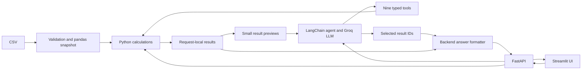

# Support Ticket AI

Python support-ticket analytics for the **DOTMappers End-to-End AI System Sprint**. The system validates the supplied 500-ticket CSV, answers natural-language questions with an LLM, detects unusual ticket timings, and exposes both a **FastAPI REST API** and a **Streamlit UI**.

The LLM selects typed tools; Python calculates the results and renders numerical answers from the supporting evidence. The dataset is included unchanged in `data/support_tickets.csv`.

## Assessment coverage

| Requirement | Implementation |
|---|---|
| Ingest CSV and make it queryable | Validated pandas snapshot, typed filters, aggregates and ticket search |
| Use an LLM for natural-language understanding | LangChain `create_agent`, Groq `openai/gpt-oss-20b`, nine typed tools |
| Detect and explain anomalies | Long-resolution IQR outliers and unresolved High/Critical tickets older than 24 hours |
| REST API and minimal UI | Five API endpoints and Overview, Questions and Anomalies UI tabs |
| Python only; zero-cost execution | Python 3.12; local services; a Groq Free Plan key for natural-language queries |
| Single-command startup | `uv run --locked python run.py` starts and supervises both services |
| Reproducible dependencies | `pyproject.toml` and `uv.lock`, the permitted equivalent of `requirements.txt` |

Section 2 of the brief explicitly requires **both API and UI**, although Section 4 says “OR”. This submission implements both. The [submission checklist](docs/submission.md) maps the deliverables and weighted evaluation criteria to files and evidence.

## Setup and single-command startup

Install [uv](https://docs.astral.sh/uv/getting-started/installation/), then run the following from the repository root, the directory containing this README:

```sh
uv sync --locked
```

`uv` selects Python 3.12 and installs the locked dependencies. Copy `.env.example` to `.env` if `.env` does not already exist. On macOS/Linux:

```sh
cp -n .env.example .env
```

Create a key in the [Groq console](https://console.groq.com/keys) using a **Free Plan account**, and set `GROQ_API_KEY` in `.env`. Keep `GROQ_MODEL=openai/gpt-oss-20b`. No OpenAI API key, paid subscription, database service, or local GPU is required. Groq lists this model with [tool support](https://console.groq.com/docs/tool-use/overview); requests remain subject to the account's [free-tier rate limits](https://console.groq.com/docs/rate-limits).

After this one-time setup, start the entire system with one command:

```sh
uv run --locked python run.py
```

| Interface | Address |
|---|---|
| UI | [http://127.0.0.1:8501](http://127.0.0.1:8501) |
| Interactive API docs | [http://127.0.0.1:8000/docs](http://127.0.0.1:8000/docs) |
| API health | [http://127.0.0.1:8000/health](http://127.0.0.1:8000/health) |

Allow a few seconds for both services to become ready. **Ctrl+C stops both.** If either service exits, the launcher stops the other and exits with an error. Both bind to localhost. If the default ports are occupied:

```sh
uv run --locked python run.py --api-port 8001 --ui-port 8502
```

The launcher automatically points the UI at the chosen API port. Without a key, the app still starts: overview, ticket search and anomaly checks work; natural-language queries return HTTP 503 with `groq_not_configured`. Health reports `degraded` and `dataset_loaded: true`. A configured key changes health to `ok`, but health does not call Groq or verify connectivity/key validity.

### Configuration

Backend settings are read from `.env` or environment variables; environment variables take precedence. Restart after changing backend settings or the dataset.

| Setting | Default | Purpose |
|---|---|---|
| `GROQ_API_KEY` | Empty | Required for natural-language questions |
| `GROQ_MODEL` | `openai/gpt-oss-20b` | Groq model used for tool selection |
| `DATA_PATH` | `data/support_tickets.csv` | Static input CSV |
| `DATA_TIMEZONE` | `UTC` | Interpretation of timezone-free source timestamps |
| `PROVIDER_TIMEOUT` | `15` | Seconds per provider attempt |
| `REQUEST_TIMEOUT` | `60` | Seconds for the complete agent request |
| `LANGSMITH_TRACING` | `false` | Tracing is also explicitly disabled in the agent |

`API_BASE_URL` is a UI environment setting, set automatically by `run.py`. The UI does not read `.env`. For separate development processes, see [architecture and operation](docs/architecture.md#local-operation-and-extension).

## Architecture and tools



- **FastAPI and Pydantic** define and validate HTTP and tool contracts, with structured errors and request IDs.
- **pandas** handles exact filtering, aggregation, time calculations and anomaly detection over 500 rows. A database or vector store is unnecessary for this static, structured dataset.
- **LangChain and ChatGroq** handle model/tool orchestration and the structured final outcome. The LLM interprets questions; it cannot run generated SQL, Python or arbitrary expressions.
- **Streamlit** provides a small Python UI with tables, charts, historical reference-time controls and calculation details.
- **uv, Ruff, mypy and pytest** provide locked dependencies, code checks and repeatable verification. GitHub Actions runs the offline checks without a model key.

The model can call dataset metadata, data quality, aggregation, ticket search, rates, trends, comparisons, time-target checks and anomaly detection. Full calculations stay in the backend; model previews are bounded and omit raw issue summaries. Successful answers must reference valid results from the same request. The backend formats the numbers shown to the user.

See [architecture](docs/architecture.md) for component decisions, the nine tool contracts, prompt/output handling, execution budgets and extension points.

## Assessment examples and expected outputs

The CSV covers **January–March 2024**. In the UI select **Historical demonstration**, or pass `"as_of":"2024-03-30T18:06:00Z"` to the query API. With the default current time, “this month” and “this week” usually have no records.

These are the five example questions from the brief. Results below are calculated from the supplied CSV at that fixed reference time. The regression fixtures use equivalent wording for some examples; the saved live report covers those fixture questions.

| Question | Expected result |
|---|---|
| How many tickets are currently open? | **111**. Answer: `count: 111 (sample count: 111).` |
| Which agent resolved the most tickets this month? | **AGT-01 and AGT-12 tie at 15 each**, using estimated resolution timestamps in March up to the reference time |
| Show me all Critical tickets not resolved within 12 hours. | **34 tickets**: 3 completed late and 31 still unresolved and overdue; the response also contains the matching rows |
| What is the average customer rating for Technical category tickets? | **3.74/5 from 104 ratings**; exact value in evidence: `3.7403846153846154` |
| Are there any anomalies in resolution times this week? | **3 long-resolution flags**, using estimated resolutions from Monday March 25 through the reference time and a global **48.15-hour** threshold |

Additional checks: 500 total tickets, 173 unresolved tickets, 31 unresolved Critical tickets, and AGT-08 with the lowest observed average rating of 3.48 from 25 ratings. Across the whole snapshot at the reference time there are 21 long-resolution outliers and 80 overdue High/Critical tickets.

### API examples

| Method and endpoint | Purpose | Calls the LLM? |
|---|---|---|
| `GET /health` | Dataset/key-configuration health | No |
| `GET /api/v1/stats` | Counts, date coverage and data-quality summary | No |
| `POST /api/v1/query` | Natural-language question and supporting results | Yes |
| `GET /api/v1/anomalies` | Explainable anomaly flags and pagination | No |
| `POST /api/v1/tickets/search` | Validated search and pagination | No |

```sh
curl http://127.0.0.1:8000/health

curl -X POST http://127.0.0.1:8000/api/v1/query \
  -H 'Content-Type: application/json' \
  -d '{"question":"How many tickets are currently open?","as_of":"2024-03-30T18:06:00Z"}'

curl 'http://127.0.0.1:8000/api/v1/anomalies?as_of=2024-03-30T18%3A06%3A00Z&rule=long_resolution&limit=50'

curl -X POST http://127.0.0.1:8000/api/v1/tickets/search \
  -H 'Content-Type: application/json' \
  -d '{"spec":{"search":"refund"},"as_of":"2024-03-30T18:06:00Z","offset":0,"limit":50}'
```

Selected fields from a successful open-ticket response, with other fields omitted for readability:

```json
{
  "status": "success",
  "answer": "count: 111 (sample count: 111).",
  "as_of": "2024-03-30T18:06:00Z",
  "dataset_fingerprint": "812984803c7e806803269aaf00da76b1adf21c6165ce58f86fd1bef20bb5ebff",
  "results": [
    {
      "kind": "aggregate",
      "summary": {
        "matched_tickets": 111,
        "metrics": {"count": {"value": 111, "sample_count": 111}}
      }
    }
  ]
}
```

Full responses also include request IDs, applied criteria, warnings, tool-execution details and paged rows. Defaults are 50 rows per API page, maximum 500; the UI requests up to 500 and paginates locally. Ticket-search criteria can be reused with `/api/v1/tickets/search` to fetch another page without a model call. The API does not retain results between requests.

Errors use `{"error":{"code":"...","message":"...","request_id":"..."}}`: invalid input/budget limits 422, provider quota 429, unusable model output 502, missing credentials/provider availability 503, and deadline 504. Quota errors include `Retry-After` when supplied. No paid-provider fallback is configured.

## Data and anomaly rules

- **Open** means recorded status `Open`; **unresolved** means `Open` or `Escalated`. Historical reference times do not reconstruct prior statuses.
- Missing values remain null. Averages exclude missing measurements and expose sample counts. No-match counts are zero; no-match averages are null.
- Weeks start Monday. Current relative periods end at the reference time; explicit ranges include their start and exclude their end. Timezone-free source timestamps use UTC by default.
- The dataset has no actual resolution timestamp. Resolution-date questions use **`created_at + resolution_time_hrs`** for recorded Resolved tickets and disclose the estimate.
- **Long-resolution rule:** calculate `IQR = Q3 - Q1` on all recorded Resolved durations using linear interpolation; flag durations strictly greater than `Q3 + 1.5 × IQR`. The supplied threshold is **48.15 hours**. Filters restrict reported flags after the global baseline is computed. Fewer than four observations or zero IQR gives an insufficient-baseline warning.
- **Overdue-priority rule:** recorded Open/Escalated tickets with High/Critical priority and age **strictly greater than 24 hours** at `as_of`. Each flag reports observed hours, threshold, excess and reason.
- The loader rejects malformed schemas, duplicate IDs, invalid timestamps/categories, non-finite/negative durations and invalid ratings. It preserves **28 resolution-before-response inconsistencies** as data-quality warnings, distinct from anomaly flags.

Source CSV SHA-256: `812984803c7e806803269aaf00da76b1adf21c6165ce58f86fd1bef20bb5ebff`.

## Verification and evidence

From the project root:

```sh
uv run --locked ruff check .
uv run --locked ruff format --check .
uv run --locked mypy
uv run --locked pytest -m 'not live'
```

The offline suite exercises calculations, all 40 labelled questions with a scripted model, real LangChain orchestration, mocked Groq serialization, API errors and pagination, Streamlit interactions, and startup/shutdown of both real services. These tests establish software behavior, **not live natural-language accuracy**.

Verified on September 17, 2026: **104 offline tests passed**, Ruff lint/format checks passed, and mypy reported no issues in 18 source files. The dependency lock check, documentation links, original CSV checksum and saved live-report fingerprint also passed. Local checks are recorded in [evaluation details](docs/evaluation.md#delivery-status-and-remaining-verification); a GitHub Actions run requires publishing the repository.

The included [live evaluation report](evaluation-results.json) records **12 passed cases**, including all five assessment example intents, **7 quota-blocked cases**, and **21 unattempted cases**. It reports `state: quota_blocked` and `acceptance_met: false`. The full 40-case live run is incomplete. The project's additional target of all five examples plus at least 36/40 passes is an internal regression target, not a threshold specified by the assessor.

To resume the included run when free quota is available:

```sh
uv run --locked python -m support_ticket_ai.evaluation --live --resume
```

To try only the five examples without overwriting the submitted report:

```sh
uv run --locked python -m support_ticket_ai.evaluation --live --official-only --output evaluation-official.local.json
```

For a fresh full run, use `--live --output evaluation-full.local.json`. Live runs consume the configured account's quota and require an internet connection. The runner saves progress after each case and now stops at the first quota response. Resume checks the application, dependency, fixture, model and dataset fingerprints. See [evaluation details](docs/evaluation.md) for coverage, verified status, limitations and exit codes.

## Known limitations

- Natural-language queries require a Groq Free Plan key, network access and available quota. The application does not inspect account billing settings; use a Free Plan account to meet the zero-cost constraint. Model availability and limits can change.
- An LLM can choose an incorrect filter or metric even when arithmetic is correct. Inspect the displayed criteria and evidence; the full live regression target remains unverified.
- Data is a static 2024 snapshot. Historical statuses cannot be reconstructed, estimated completion dates can differ from reality, and the global IQR baseline is not a historical backtest. Reported source inconsistencies remain in calculations.
- This is a local prototype without authentication, persistent storage, uploads, ticket writes, notifications or chat history. It is not ready for public multi-user deployment.
- Questions are bounded to 2,000 characters, four model turns and three data-tool calls. Large/complex requests may need narrowing. Raw issue summaries are excluded from model context, so semantic interpretation of every free-text ticket is not supported.
- The user's question and small tool-result previews go to Groq. The complete CSV and raw issue-summary columns do not. Tracing is disabled; logs omit questions, ticket rows and credentials.

## Submission files

```text
support-ticket-ai/
├── README.md
├── run.py                       # One-command API + UI launcher
├── pyproject.toml, uv.lock       # Python and dependency declarations
├── .env.example, .gitignore
├── .github/workflows/ci.yml      # Offline checks
├── data/support_tickets.csv     # Original 500-row input
├── src/support_ticket_ai/       # API, tools, analytics, evaluation runner
├── ui/app.py                    # Streamlit UI
├── tests/                      # Unit/integration tests and labelled cases
├── evaluation-results.json      # Partial live evidence, included in submission
└── docs/
    ├── architecture.md
    ├── evaluation.md
    └── submission.md            # Deliverable checklist and walkthrough
```

The required handoff is a **GitHub repository link**. Follow [the submission checklist](docs/submission.md) for repository contents, the exact recipient/subject, the 48-hour deadline rule and the 30-minute walkthrough. A ZIP is a convenience copy, not a replacement for the required GitHub link.
