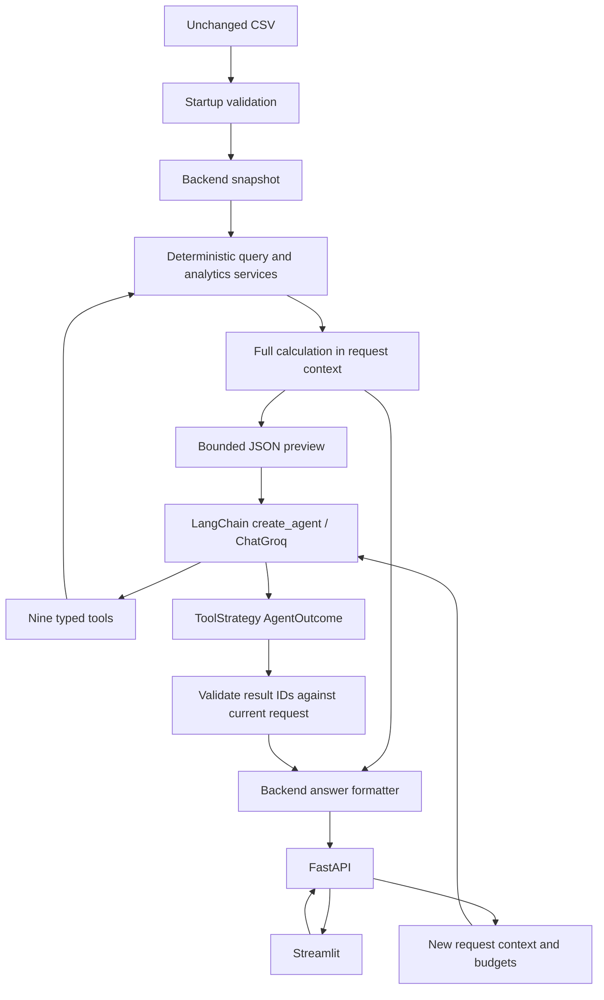

# Architecture

[README](../README.md) · [Evaluation](evaluation.md) · [Submission](submission.md)

The application separates interpretation, calculation, and presentation. The LLM is a query planner and evidence selector. It never executes expressions or supplies the numerical answer shown to the user.



## Component decisions

| Choice | Reason and trade-off |
|---|---|
| Validated pandas snapshot | Fits the supplied 500-row CSV and exact analytics; no database to deploy. Updates require a restart. |
| Typed calculation tools | Reuses deterministic services across API and LLM paths, bounds allowed operations, and supplies inspectable evidence. Less flexible than unrestricted generated code. |
| LangChain `create_agent` and ChatGroq | Provides native tool orchestration and typed final outcomes; introduces framework dependencies but avoids a custom agent loop. |
| Groq `openai/gpt-oss-20b` on a Free Plan account | Provides tool calling without a local GPU. Requires network access, credentials and available free quota. No paid fallback is configured. |
| FastAPI and Streamlit | Satisfies both required interfaces with Python. Streamlit keeps UI implementation small; it is a local prototype interface. |
| Global IQR outliers plus a fixed age rule | IQR is explainable and less sensitive to large values than a mean-based cutoff; the 24-hour rule directly represents the brief's priority example. The global baseline is not a historical backtest or category-specific model. |
| Standard-library process launcher | One command owns both service lifecycles without Docker or extra dependencies. This is local supervision, not production deployment. |

## Prompt and structured output

`agent/prompts.py` provides field definitions, status/date semantics, tool-selection examples, clarification rules and the instruction to choose evidence IDs. It contains no dataset rows. The final `AgentOutcome` has a constrained status (`success`, `clarification` or `unsupported`), result IDs, and a message for non-success outcomes. The backend supplies successful numerical prose from calculations. This removes model arithmetic from the answer path, while leaving tool/filter-selection accuracy as a live-evaluation concern.

## Ownership

| Module | Owns | Does not own |
|---|---|---|
| `config.py` | Environment settings, secret wrapper, timezone validation | Model requests |
| `dataset.py` | CSV validation, immutable-by-interface snapshot, metadata, fingerprint | User query execution |
| `schemas.py` | Allowlisted fields, predicates, typed tools, public contracts | pandas calculations |
| `dates.py` | Timezone normalization, date resolution, date caveats | Status reconstruction |
| `query.py` | Filtering, literal search, metrics, ranking, quality report | Model interpretation |
| `analytics.py` | Rates, comparisons, trends, time-target states | Anomaly baseline selection |
| `anomalies.py` | Global IQR and High/Critical overdue rules | Correcting questionable source records |
| `agent/tools.py` | Nine thin async LangChain adapters | Duplicate business calculations |
| `agent/context.py` | Request-local evidence, execution counters, output serialization | Global/persistent results |
| `agent/execution.py` | Agent creation, middleware, sequential calls, provider errors/retries | Answer arithmetic |
| `agent/prompts.py` | Business rules, schema, examples, tool-selection guidance | CSV rows |
| `responses.py` | Evidence validation handoff, numerical rendering, result pages | Trusting model-written numbers |
| `api.py`, `main.py` | HTTP contracts, data/client lifecycle, error boundary | UI state |
| `ui/app.py` | Controls, tables/charts, returned-row pagination | Groq credentials or local CSV access |
| `run.py` (repository root) | Starts both local services, supplies the UI API address, stops both on exit | Query processing |
| `evaluation.py` | Explicit live evaluation and safe result reporting | CI network calls |

## Request lifecycle

1. Startup validates the complete file once and computes its SHA-256. Business inconsistencies remain in the snapshot; structurally invalid inputs fail startup with column and source-line diagnostics.
2. FastAPI validates the question length, reference timestamp, and page bounds. A request ID is generated server-side. Each question gets a fresh `RequestContext`.
3. `create_agent` receives the question and a schema/business-only prompt, with reference time appended. `ToolRuntime` injects the dataset and result store invisibly to the model.
4. Native tools expose standard JSON Schema: argument, metric, cohort, and selection objects are inline; shared predicate and date definitions use local `$defs`/`$ref` references. Unused definitions are removed. Common operator/date rules are also explicit in the prompt. Python validates every call using the full Pydantic models. This limits request size while keeping argument shapes clear.
5. A call passes through middleware, consuming its budget even if unknown or malformed. Pydantic then validates arguments; calculation functions operate on a copy of the startup snapshot.
6. The complete `Calculation` goes into `ctx.results`. Only a bounded, valid JSON summary goes into the tool message. Issue-summary fields are removed from previews. Full tables are never serializable graph state or conversation messages.
7. `ToolStrategy(AgentOutcome)` adds a final structured function. The model selects successful result IDs, or requests clarification/declines an unsupported task. No free-form successful answer is accepted.
8. The backend checks every selected ID against the current request's store, formats exact calculated values, and attaches the requested result pages, criteria, counts, and warnings. Request-local evidence is released afterwards.
9. Streamlit keeps the API response in its session state and paginates it locally. Deterministic ticket search/anomaly endpoints support other API clients fetching later pages without using a model.

## Boundaries and limits

Groq's `disable_tool_validation` option lets malformed tool calls reach the application instead of ending the request at the provider. This does not permit unvalidated execution: local middleware checks the tool allowlist and validates the complete Pydantic argument schema before calling a calculation. Rejections return only safe field paths and error types, allowing correction within the same execution budget. Unknown tools cannot execute, and final evidence IDs are independently checked. See the [Groq API parameter](https://console.groq.com/docs/api-reference).

Sequential tools are enforced both by `parallel_tool_calls=false` and by rejecting model responses containing more than one tool call. Maximums: four model turns, three data-tool calls, one transient retry for the whole question, 15 seconds per provider attempt, and a 60-second overall deadline by default. Groq's built-in retry loop is disabled. Authentication and quota failures are not retried. The final synthetic `AgentOutcome` call is processed by LangChain's structured-output mechanism and does not consume a data-tool slot.

Tool messages are compact UTF-8 JSON, with a 4 KiB per-call and 8 KiB cumulative budget. Ticket/quality/anomaly/target results show at most five preview records; aggregates and trends show at most 20. Serialization first trims preview rows, then removes oversized detailed criteria/summary/warnings from model content, retaining them in backend evidence and marking truncation. If even the minimum envelope cannot fit, the request ends with a bounded error. API result tables remain independent of this model-output budget.

Predicates are restricted to known fields and compatible operations; a query has no more than 20 conditions, including both populations for comparisons/rates. Membership values and strings are bounded. No expression evaluation, regex from users, dynamic code, shell, browser, SQL, or arbitrary filesystem tool exists. Dataset text is never interpreted as instructions. Unknown tools cannot execute.

Tracing is explicitly disabled around every agent invocation. There are no agent checkpoints, chat-history persistence, external tracing callbacks, databases, vector stores, or Redis. The graph can be reused concurrently because data/results/counters belong to separate request contexts. HTTP clients are created for application lifespan and closed on shutdown.

Groq prompt caching is provider-managed and may reuse prefixes; it is not application conversation history. No full dataset is sent in cached or uncached requests. A user's own question and selected small calculation previews are sent to Groq to answer that question.

## Tools and contracts


All nine tools accept a `spec` object validated with Pydantic. Runtime context supplies the dataset and result store; it is absent from model-visible arguments. Groq returns generated calls to the backend, where the allowlist and full schemas are checked before execution; invalid calls can be corrected within the request's fixed budget.

| Tool | Input contract | Returned evidence | Example |
|---|---|---|---|
| `get_dataset_info` | `section`: `overview`, `schema`, `definitions` | Coverage, counts, field descriptions, allowed values, agent IDs, null/metric semantics; no records | What information is available? |
| `get_data_quality_report` | `warning_type`, `selection` | Missing counts, timing/status inconsistencies, affected fields and bounded ticket-ID preview | Are there inconsistent durations? |
| `aggregate_tickets` | `metrics`, `selection`, `group_by`, `rank_metric`, `descending`, `top_n` | Exact scalar/group metrics and sample counts; tied rankings retained | Which agent has the lowest average rating? |
| `list_tickets` | `selection`, literal `search`, `columns`, `sort_by`, `descending` | Match count, criteria, bounded preview; full backend table | Show unresolved Billing tickets mentioning refund |
| `calculate_ticket_rate` | `base`, `matching` selections | Numerator, denominator, fraction, percentage; numerator is a subset of base | What percentage of Critical tickets are unresolved? |
| `get_ticket_trends` | `selection`, `time_field`, `interval`, `metric` | Chronological buckets, counts, coverage warnings; backend chart series | Chart weekly ticket creation volume |
| `compare_ticket_metrics` | Named `baseline` and `comparison` selections, `metrics` | Values, sample sizes, absolute differences, percentage changes | Compare Billing and Technical resolution durations |
| `check_time_target` | `selection`, `target`, `threshold_hours`, `breaches_only` | Completed within/late, pending within/overdue, unknown; supporting tickets | Show Critical tickets not resolved within 12 hours |
| `detect_anomalies` | `selection`, `rule`: `all`, `long_resolution`, `overdue_high_priority` | Global IQR threshold, flag counts, observed/excess hours, explanations | Were there long-resolution outliers this week? |

Shared selection format:

```json
{
  "where": [
    {"field": "priority", "op": "eq", "value": "Critical"},
    {"field": "status", "op": "in", "value": ["Open", "Escalated"]}
  ],
  "any_of": [],
  "date_window": {"field": "created_at", "period": "this_month"}
}
```

`where` conditions are ANDed. `any_of` is an OR of AND-groups, additionally ANDed with `where`. Omit a date window for all recorded dates up to the reference time. At most 20 conditions are accepted across the entire specification, including both populations for rates/comparisons.

Operations: `eq`, `ne`, `gt`, `gte`, `lt`, `lte`, `in`, `not_in`, `contains`, `is_null`, `not_null`. `contains` is case-insensitive literal matching, never regex. Null checks omit `value`; membership supplies a bounded list. Categorical values and operation/field compatibility are validated. No generated SQL, Python, expressions, filesystem tools, or pandas `query` are used.

Metrics use `{ "operation": "average", "field": "customer_rating" }`. Supported operations: `count`, `distinct_count`, `average`, `sum`, `min`, `max`, `median`, `percentile`. Count has no field; percentile additionally takes a number from 0 to 100. Only recorded duration fields can be summed. Groupings are `agent_id`, `category`, `priority`, and `status`, up to two fields. At most five metrics are accepted per aggregate/comparison. `top_n: 1` includes all tied winners.

Every model tool result includes its request-local result ID, status, bounded evidence, explicit criteria, reference time, fingerprint, warnings, and truncation information. The backend retains the complete calculation separately. Limits:

- Question: 2,000 characters.
- Model-visible aggregate/series preview: at most 20 rows; ticket/anomaly/quality/target preview: at most five.
- Tool content: at most 4 KiB each and 8 KiB total per question, measured as compact UTF-8 JSON. If necessary, detailed criteria/summary remain only in backend evidence.
- Four model turns, three data-tool calls, at most one transient network/server retry across the request. Invalid calls consume budget. ToolStrategy's final outcome call is not a data-tool call.
- API page: 50 rows by default, maximum 500. The UI requests up to 500 rows, sufficient for the supplied ticket dataset and its supported chart series. Trend requests allow at most 366 buckets.

## Calculation and date semantics


- **Open** means status `Open`; **unresolved** means `Open` or `Escalated`.
- Missing measurements stay null. Averages exclude them and report non-null sample counts. Empty counts are zero; empty averages are null.
- Rates use `numerator / denominator × 100`; an empty denominator produces null with a warning. Comparison change is `(comparison − baseline) / baseline × 100`; zero/missing baselines make change undefined.
- Weeks begin Monday. Relative periods: `today`, `this_week`, `last_week`, `this_month`, `last_month`, `this_year`, `last_year`. Current periods end at and include `as_of`. Explicit ranges are start-inclusive/end-exclusive.
- Source timezone-free timestamps use `DATA_TIMEZONE` (UTC by default). Explicit timezone-aware inputs are converted to that timezone. Creation filters exclude records created after `as_of`.
- Resolution-date questions use **`resolved_at_estimated = created_at + resolution_time_hrs`**, only for recorded Resolved tickets. This is an estimate, not a measured completion timestamp.
- Statuses remain the recorded snapshot even with historical `as_of`. “Open by week” is a distribution of currently recorded Open tickets by creation week, never historical backlog.
- Trend counts fill empty buckets with zero; other empty measurements are null. Coverage warnings disclose requested periods outside recorded timestamps.
- A target breach is **strictly greater than** the supplied hour threshold. Pending tickets within target are pending, not completed. A missing first-response measurement is unknown. Targets are analytical thresholds, not contractual SLAs.

**Long-resolution anomaly:** among globally recorded Resolved tickets with valid durations, compute Q1 and Q3 using linear interpolation, then `IQR = Q3 − Q1` and `upper = Q3 + 1.5 × IQR`. Flag durations strictly above `upper`. Filters restrict reported flags after establishing this global baseline. Fewer than four observations or zero IQR produces an insufficient-baseline warning.

**Overdue priority anomaly:** recorded Open/Escalated status, High/Critical priority, and age strictly above 24 hours at `as_of`. Each flag includes observed duration, threshold, excess, and reason. Flags are separate from business-quality warnings. An unresolved record with contradictory completion measurements remains flagged by status/age while the quality report separately discloses the conflict.

The loader rejects malformed schemas, duplicate IDs, invalid timestamps/categories, non-finite or negative durations, and non-integral ratings outside 1–5. It preserves all **28** resolution-before-response inconsistencies as warnings. These original measurements remain included in calculations; no silent cleanup changes assessment answers.

## Semantics that must survive changes

- Snapshot statuses never become historical state transitions merely because `as_of` changes.
- Relative dates resolve on the server, in the configured timezone. Creation and estimated-resolution filters are distinct.
- First-response nulls are unknown. Pending resolution is not target attainment. Equal-to-threshold is not a breach.
- Rating sample counts count observed ratings, not all tickets in the group.
- Rank after aggregation and include boundary ties. Missing metrics sort last and cannot win top-N rankings.
- Rate numerator is selected from the denominator population, so it cannot exceed it.
- Comparison percentage changes are relative to baseline; missing/zero baselines stay undefined.
- Long-resolution outliers use the global resolved baseline before display filters. Statistical anomalies and data-quality issues are distinct.
- Answers come from selected backend results. A result ID from another request must never resolve successfully.
- Model-output caps may reduce model visibility, not the underlying calculations or API evidence.

## Local operation and extension

After setup, `uv run --locked python run.py` starts both services on localhost (API 8000, UI 8501). `--api-port` and `--ui-port` select alternatives; the launcher sets `API_BASE_URL` for the UI. Ctrl+C/SIGTERM or a child-process exit triggers cleanup of both children. The launcher uses the repository directory for relative data/configuration paths.

For development only, the services can also be started separately in two terminals from the repository root:

```sh
uv run --locked uvicorn support_ticket_ai.main:app --reload --host 127.0.0.1 --port 8000 --log-config src/support_ticket_ai/logging.json
```

```sh
uv run --locked streamlit run ui/app.py --server.address 127.0.0.1 --server.port 8501 --browser.gatherUsageStats false
```

If the API address differs, export `API_BASE_URL` in the Streamlit terminal. The UI does not load the backend `.env` file.


The current target is one local instance, a trusted static CSV, and independent questions. The data file is small enough for pandas copies and ordinary in-process result objects. A database, async job queue, distributed orchestration, generic repository layer, or vector database adds no value for the assessment's scope.

For larger datasets, replace the service implementation while preserving schemas and calculation semantics; revisit bounded result transport and introduce an explicitly expiring result store only if durable pagination is needed. To add a business capability, add its deterministic calculation and meaningful edge-case tests before adding a tool adapter. Do not expand to unsafe generic execution tools.
